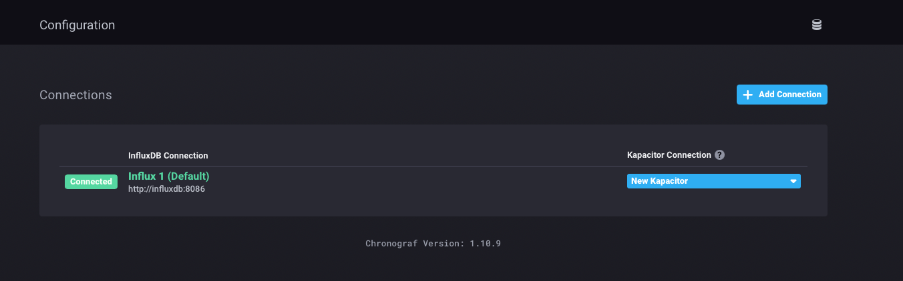
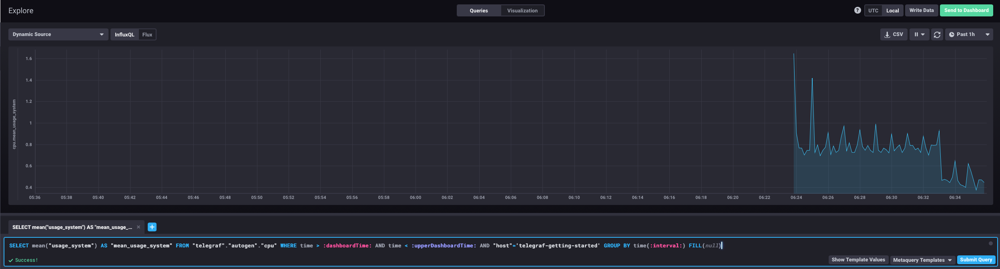
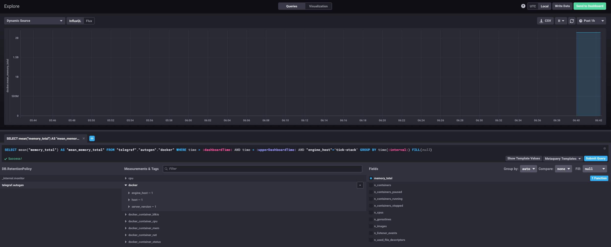

# Домашнее задание к занятию «Системы мониторинга» – Артур Ишмаков

---

**Задание 1.**  
Какой минимальный набор метрик вы выведите в мониторинг и почему?

**Решение:**

Для платформы с HTTP-интерфейсом, вычислительной нагрузкой и сохранением отчётов на диск:

- **CPU** — загрузка процессора (%), Load Average. Вычисления грузят CPU, это ключевая метрика
- **RAM** — использование памяти, swap. Если пошёл swap — система тормозит
- **Диск** — свободное место, inodes, disk I/O. Отчёты пишутся на диск, место может закончиться
- **HTTP** — время ответа (latency), коды ответов (2xx/4xx/5xx), RPS
- **Сеть** — трафик in/out

---

**Задание 2.**  
Менеджер продукта не понимает технические метрики. Что предложить?

**Решение:**

Предложить бизнес-метрики и SLA-дашборд на понятном языке:

- **Доступность сервиса** — процент времени, когда платформа работает (например, 99.9%)
- **Среднее время ответа** — сколько секунд клиент ждёт результат
- **Процент успешных запросов** — доля запросов без ошибок
- **Количество обработанных отчётов** — сколько работы сделано
- **Error budget** — сколько ошибок мы ещё можем допустить в этом месяце

Всё оформить в виде простого дашборда без технического жаргона.

---

**Задание 3.**  
Нет бюджета на систему сбора логов. Как дать разработчикам доступ к ошибкам?

**Решение:**

1. **Sentry (бесплатный план)** — разработчики получат стектрейсы и контекст ошибок
2. **Отправка ошибок в Telegram/Slack** — webhook при возникновении ошибки
3. **Отдельный лог-файл для ошибок** — настроить ротацию и дать разработчикам доступ
4. **journalctl** — `journalctl -u service-name -p err`
5. **Скрипт по крону** — grep ошибок из логов и отправка на почту/в чат

---

**Задание 4.**  
SLA=99% не поднимается выше 70%. Формула: `summ_2xx_requests / summ_all_requests`. Кодов 5xx и 4xx нет. Где ошибка?

**Решение:**

Не учтены коды 1xx (информационные) и 3xx (редиректы). 30% ответов — это редиректы (301, 302, 304), которые формула считает «неуспешными», хотя это штатное поведение.

Правильная формула:
```
(summ_2xx + summ_3xx) / summ_all_requests
```
Или строже:
```
(summ_all - summ_5xx) / summ_all_requests
```

---

**Задание 5.**  
Основные плюсы и минусы pull и push систем мониторинга.

**Решение:**

**Pull (Prometheus, Nagios):**
- Легко понять, что агент упал — не отвечает на запрос
- Единая точка конфигурации на сервере
- Нет риска перегрузки сервера потоком данных
- Нужна сетевая доступность к агентам (проблема с NAT/firewall)
- Сложнее мониторить короткоживущие задачи

**Push (Telegraf → InfluxDB, Graphite):**
- Работает за NAT и firewall
- Подходит для динамических окружений и контейнеров
- Сложнее понять, что агент упал — просто перестаёт слать данные
- Можно перегрузить сервер при массовой отправке
- Настройка размазана по агентам

---

**Задание 6.**  
Классификация систем мониторинга: pull, push или гибридная?

**Решение:**

| Система | Модель |
|---------|--------|
| **Prometheus** | Pull, есть Pushgateway для коротких задач |
| **TICK** | Push — Telegraf отправляет метрики в InfluxDB |
| **Zabbix** | Гибридная — passive checks (pull) и active checks (push) |
| **VictoriaMetrics** | Гибридная — pull как Prometheus + push через remote write |
| **Nagios** | Pull, поддерживает passive checks (push) через NSCA |

---

**Задание 7.**  
Склонируйте sandbox и запустите TICK-стэк. Приведите скриншот веб-интерфейса Chronograf.

**Решение:**

Развернул TICK-стэк через docker-compose на LXC-контейнере в Proxmox.

Веб-интерфейс Chronograf:


Подключение к InfluxDB и Kapacitor:



---

**Задание 8.**  
Перейдите в Data Explorer и приведите скриншот метрик утилизации CPU.

**Решение:**

Выбрал базу `telegraf.autogen`, measurement `cpu`, host `telegraf-getting-started`, field `usage_system`:



---

**Задание 9.**  
Добавьте плагин docker в telegraf и приведите скриншот списка measurements.

**Решение:**

Добавил `[[inputs.docker]]` в конфигурацию telegraf, перезапустил контейнер. Появились docker-метрики:


